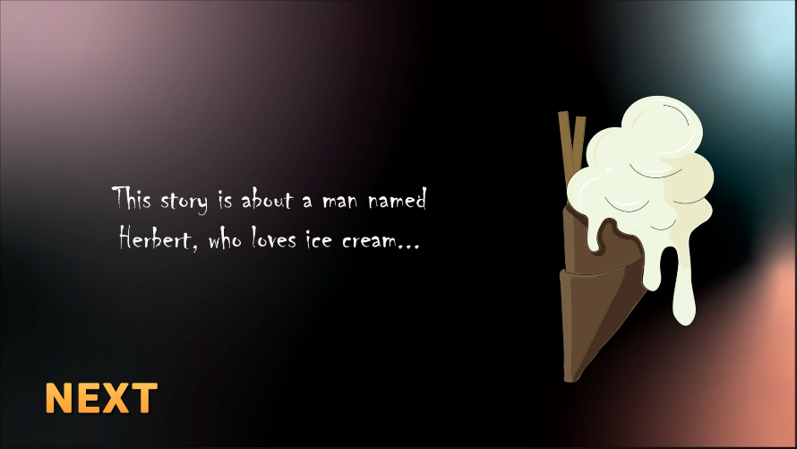

# Sweet Herbert

Course: Design for Games & Play I

## Game Description
* Sweet Herbert is a level-based, role-playing game (RPG) set in a 3D world.
* Its basic premise is simple; in this game, the player takes on the role of Herbert, an evil protagonist whose dark upbringing leads him to take revenge on the world with his love for ice cream.
* The player must control his ice cream truck, drive around the city and sell deadly ice cream to citizens, all while avoiding his archenemies, the hotdog carts.
* The main goal of the final game will be to become the most feared ice cream seller in history, by upgrading your truck, buying new ice cream flavors
and much more.
* The player can also replay the levels to beat their high score or to complete bonus challenges within these levels.

## Screenshots

Story

 

Shop

 

Gameplay

